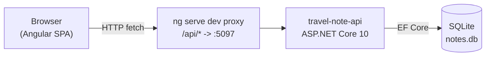
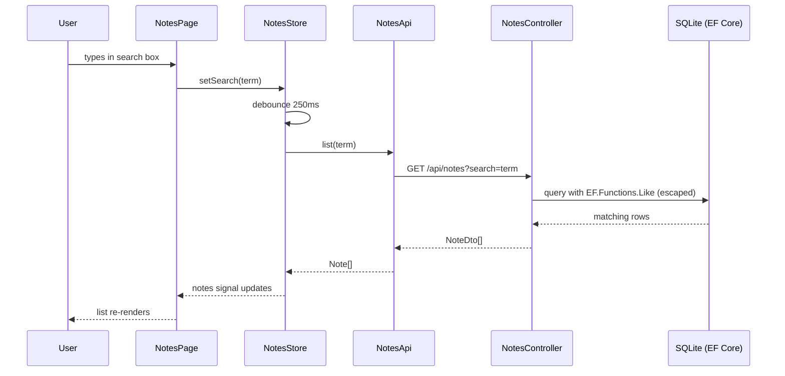

# Architecture

## Overview

Travel Notes is a two-tier web app: an Angular single-page frontend and an
ASP.NET Core Web API backend, backed by a single SQLite file. There is no
message queue, cache, or background worker — the whole system is a synchronous
request/response CRUD loop.

In production-style deployment (no dev server), the frontend would instead be
served as static files with the API reachable directly or behind a reverse
proxy — but that setup does not currently exist in this repo; today the FE and
API are only wired together via the Angular CLI dev proxy (see
[development.md](development.md)).

## Backend

- **Framework**: ASP.NET Core 10, minimal hosting model (`Program.cs`), one
  MVC controller (`NotesController`) — no Razor pages, no Blazor.
- **Persistence**: EF Core + SQLite (`Microsoft.EntityFrameworkCore.Sqlite`).
  Schema is created via `Database.EnsureCreated()` at startup — **there are no
  EF migrations**. See [data-model.md](data-model.md) for what that means in
  practice.
- **API docs**: `Microsoft.AspNetCore.OpenApi` generates an OpenAPI document,
  mapped at `/openapi` — but only when `ASPNETCORE_ENVIRONMENT=Development`.
- **Cross-cutting concerns intentionally absent**: no authentication/
  authorization, no explicit CORS policy, no request logging middleware beyond
  the framework defaults. This is a deliberate simplicity trade-off for an
  example app, not an oversight.

## Frontend

- **Framework**: Angular 22, fully standalone (no `NgModule`), bootstrapped via
  `bootstrapApplication()` in `main.ts` with `provideRouter`, `provideHttpClient`
  (fetch-based), and global error listeners.
- **Structure**: a single routed feature (`features/notes`) plus a `core`
  layer (API client + signal-based store) and a `shared` layer (presentational
  UI primitives). See [frontend.md](frontend.md) for details.
- **State management**: Angular signals, not NgRx/Redux — see `NotesStore`.
- **Map**: OpenLayers renders OpenStreetMap tiles and note-location pins inside
  the dedicated `features/notes/location-map` component. The component owns
  imperative map lifecycle/events and emits selection or geographic-position
  events to `NotesPage`; map state is not held in the store.

## Request flow (list notes example)

## Key architectural decisions

| Decision | Rationale | Trade-off |
|---|---|---|
| `EnsureCreated()`, no migrations | Simplest possible schema bootstrap for an example app | Any future schema change requires deleting `notes.db` or manually adding migrations later |
| SQLite | Zero-config, file-based, easy to reset | Single-process only, no distributed transactions |
| UTC `DateTime` + `ValueConverter` | SQLite drops `DateTimeKind`; converter forces UTC back on read so JSON keeps the trailing `Z` | Extra mapping code in `NotesDbContext` |
| No auth/authz | Out of scope for an SDD example app | Not production-ready as-is |
| No explicit CORS policy | Dev proxy avoids cross-origin calls entirely | A standalone-hosted FE would need CORS configured |
| `Microsoft.OpenApi` pinned to 2.7.5 | 2.0.0 has CVE-2026-49451; 3.x breaks the `Microsoft.AspNetCore.OpenApi` source generator (`IOpenApiMediaType.Example` is readonly) | Must re-check this pin before any future upgrade |
| Signals instead of NgRx | Small, single-feature app; signals are enough reactivity | Would need revisiting if state complexity grows significantly |
