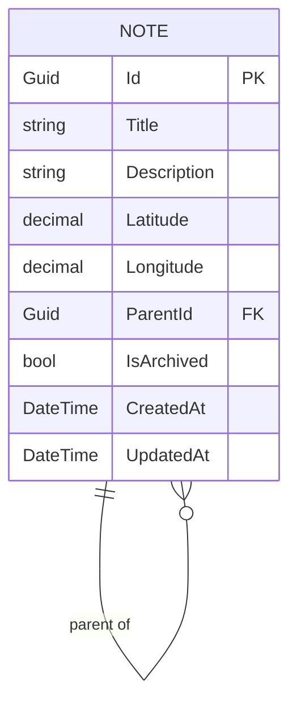

# Data Model

## `Note` entity

`Note` is a note-location: one record represents both travel-note content and a node in a user-defined location hierarchy.

| Field | Type | Notes |
|---|---|---|
| `Id` | `Guid` | Primary key, generated on creation |
| `Title` | `string` | Required, trimmed, max 200 characters |
| `Description` | `string` | Optional content, stored as an empty string, max 20,000 characters |
| `Latitude` | `decimal` | Required, -90 through 90 |
| `Longitude` | `decimal` | Required, -180 through 180 |
| `ParentId` | `Guid?` | Optional self-reference, chosen at creation and immutable afterward |
| `IsArchived` | `bool` | Defaults to false; an archived childless item may be deleted |
| `CreatedAt` | `DateTime` | UTC, set once at creation |
| `UpdatedAt` | `DateTime` | UTC, updated on every successful update |

Multiple roots are allowed. A parent can contain note content and children. Coordinates never determine the parent relationship.

## Persistence

- **Engine**: SQLite, single file `notes.db` (connection string `Notes` in
  `appsettings.json`: `Data Source=notes.db`).
- **Schema creation**: `NotesDbContext.Database.EnsureCreated()` runs once at
  app startup (see `Program.cs`). **There are no EF Core migrations in this
  project.** Practically this means:
  - Changing the `Note` shape requires either deleting the existing `notes.db`
    file (data loss, fine for local dev) or introducing EF migrations before
    making the change in a way that must preserve existing data.
  - `EnsureCreated()` will *not* apply schema changes to an existing database —
    it only creates the schema if the database doesn't exist yet.
- **UTC handling**: SQLite does not preserve `DateTimeKind`. `NotesDbContext`
  registers a `ValueConverter<DateTime, DateTime>` that converts to UTC on
  write and calls `DateTime.SpecifyKind(v, DateTimeKind.Utc)` on read, so JSON
  serialization always includes the trailing `Z`. Without this, timestamps
  would round-trip as unspecified-kind and lose the `Z` suffix.
- **Indexes**: `UpdatedAt` supports the default descending listing order; `ParentId` supports direct-child lookup.
- **Query pattern**: reads use `AsNoTracking()` since the API is stateless
  request-per-call and never needs to mutate a previously-read tracked entity.

## Lifecycle

- Active childless items may be archived through an update.
- Archived items may be restored through the edit form.
- Only archived childless items may be deleted.
- Parents with children cannot be archived or deleted; the API rejects the action even if the UI is stale.

## Frontend model mirror

The Angular app's `NoteLocation`/`NoteLocationInput` interfaces in
`fe/travel-notes-app/src/app/core/models/note.ts` mirror the backend DTOs,
including GUIDs as strings and UTC timestamps as ISO strings.
