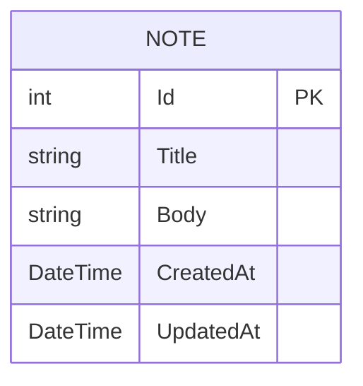

# Data Model

## `Note` entity

| Field | Type | Notes |
|---|---|---|
| `Id` | `int` | Primary key, auto-increment |
| `Title` | `string` | Required, max 200 chars, never null (`= string.Empty` default) |
| `Body` | `string` | Required column (defaults to empty string), max 20000 chars enforced at the DTO/validation layer |
| `CreatedAt` | `DateTime` | UTC, set once at creation |
| `UpdatedAt` | `DateTime` | UTC, updated on every write; indexed for sort performance |

There is only one entity — no relationships, no foreign keys.

## Persistence

- **Engine**: SQLite, single file `notes.db` (connection string `Notes` in
  `appsettings.json`: `Data Source=notes.db`).
- **Schema creation**: `NotesDbContext.Database.EnsureCreated()` runs once at
  app startup (see `Program.cs`). **There are no EF Core migrations in this
  project.** Practically this means:
  - Changing the `Note` shape requires either deleting the existing `notes.db`
    file (data loss, fine for local dev) or introducing EF migrations before
    making the change in a way that must preserve existing data.
  - `EnsureCreated()` will *not* apply schema changes to an existing database —
    it only creates the schema if the database doesn't exist yet.
- **UTC handling**: SQLite does not preserve `DateTimeKind`. `NotesDbContext`
  registers a `ValueConverter<DateTime, DateTime>` that converts to UTC on
  write and calls `DateTime.SpecifyKind(v, DateTimeKind.Utc)` on read, so JSON
  serialization always includes the trailing `Z`. Without this, timestamps
  would round-trip as unspecified-kind and lose the `Z` suffix.
- **Index**: `UpdatedAt` is indexed to support the default descending sort used
  by `GET /api/notes`.
- **Query pattern**: reads use `AsNoTracking()` since the API is stateless
  request-per-call and never needs to mutate a previously-read tracked entity.

## Frontend model mirror

The Angular app's `Note`/`NoteInput` interfaces
(`fe/travel-notes-app/src/app/core/models/note.ts`) intentionally mirror the
backend DTOs field-for-field (including `createdAt`/`updatedAt` as ISO strings,
not `Date` objects) — keep both in sync if the API shape changes.
