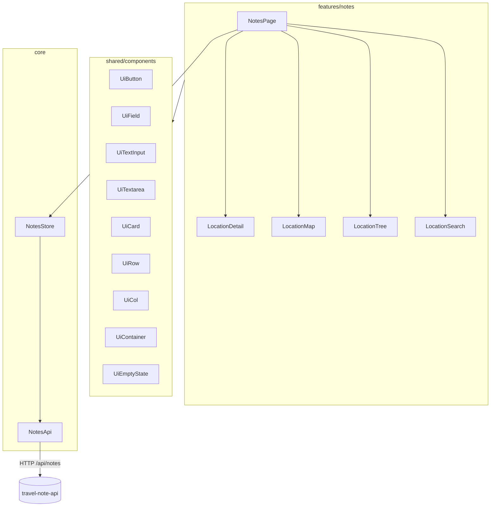

# Frontend

`fe/travel-notes-app` is an Angular 22 standalone app (no `NgModule`s), using
signals for state, `pnpm` as the package manager, and Vitest for tests.

## Bootstrap & routing

- `main.ts` calls `bootstrapApplication(App, appConfig)`.
- `app.config.ts` provides `provideBrowserGlobalErrorListeners()`,
  `provideRouter(routes)`, and `provideHttpClient(withFetch())`.
- `app.routes.ts` has exactly one real route — `''` → `NotesPage` — plus a
  wildcard redirect back to `''`. There is currently only one page in the app.

## Layering

### `features/notes` — the one vertical slice

- **`NotesPage`** (container, `OnPush`): owns the search control, calls `store.load()`, and composes the desktop tree/map/detail workspace. CSS stacks map, tree, then detail on small screens.
- **`LocationTree`**: recursive presentational hierarchy with expanded, selected, and muted archived states.
- **`LocationMap`**: an OpenLayers wrapper using OpenStreetMap tiles. It renders current markers, emits marker selection, and emits a coordinate point only in create/edit mode.
- **`LocationDetail`**: read-only note view and shared create/edit form. Parent selection is never shown during editing. It also exposes archive/restore and archived-leaf deletion actions.
- **`LocationSearch`**: type-ahead input and button-based matching-result list; a selected result returns to the normal tree/map/detail navigation flow.

### `core` — state and data access

- **`NotesStore`** (`providedIn: 'root'`) — the single source of truth for
  notes state, built entirely from signals:
  - `roots`, `childrenByParent`, `selected`, `expandedIds`, `breadcrumb`, and derived map `markers` signals synchronize browsing state.
  - `mode` and `draftCoordinates` hold create/edit state and map-selected positions.
  - Type-ahead input is debounced by 250 ms with RxJS and `takeUntilDestroyed()`; selecting a result clears the input and invokes normal selection/ancestor expansion.
  - Mutations reload roots and retain or update selection; deleting a selected child returns selection to its parent.
  - Only `NotesPage` is expected to inject this store directly; other
    components receive data via `@Input`/emit via `@Output`.
- **`NotesApi`** (`providedIn: 'root'`) is a thin `HttpClient` wrapper for root/child/detail/search reads and location mutations; the store adapts its observables via `firstValueFrom`.
- **`core/models/note.ts`** defines GUID-string `NoteLocation`, input, marker, ancestor, and search-result shapes.

### `shared/components` — presentational UI primitive library

All exported from `shared/components/index.ts`; features compose these instead
of writing raw styled `<button>`/`<input>` elements:

| Primitive | Purpose |
|---|---|
| `UiContainer` | Page-level max-width wrapper (`sm`/`md`/`lg`) |
| `UiRow` / `UiCol` | Flex layout helpers with token-driven `gap`, `align`, `justify` |
| `UiCard` | Surface/border/shadow wrapper, content projection only |
| `UiField` | Label + hint/error wrapper around a form control |
| `UiTextInput` / `UiTextarea` | `ControlValueAccessor` form controls, bindable via `[formControl]`/`formControlName` |
| `UiButton` | Variant-based button (`primary`/`secondary`/`danger`/`ghost`) |
| `UiIconButton` | Compact accessible icon-only control, used for tree expansion and adding roots |
| `UiEmptyState` | Heading + message placeholder for empty lists |

Conventions (see also [conventions.md](conventions.md)):
- All primitives are `OnPush`, use signal `input()`/`output()`, and inject no
  services — purely presentational.
- All styling comes from CSS custom properties (design tokens) defined in
  `src/styles.css` — colors, spacing (`--space-1`..`--space-6`, 8px-derived
  scale), radii, typography, shadows. No component hardcodes colors/spacing.

## HTTP + dev proxy

`proxy.conf.json` forwards `/api/*` to `http://localhost:5097` during
`ng serve`, so the frontend never needs CORS configuration in development —
see [development.md](development.md).

## Testing

Vitest (via `@angular/build:unit-test`), with `TestBed` for component/service
specs. Services are tested with mocked dependencies (`vi.fn()` returning RxJS
observables); component specs use `ComponentFixture` + `fixture.componentRef.setInput()`.
