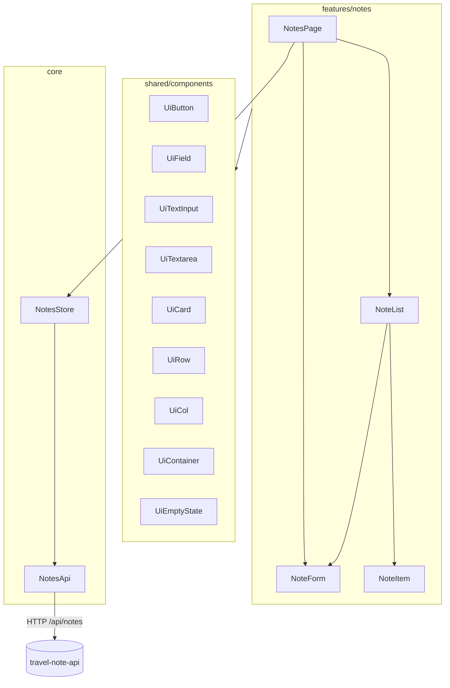

# Frontend

`fe/travel-notes-app` is an Angular 22 standalone app (no `NgModule`s), using
signals for state, `pnpm` as the package manager, and Vitest for tests.

## Bootstrap & routing

- `main.ts` calls `bootstrapApplication(App, appConfig)`.
- `app.config.ts` provides `provideBrowserGlobalErrorListeners()`,
  `provideRouter(routes)`, and `provideHttpClient(withFetch())`.
- `app.routes.ts` has exactly one real route — `''` → `NotesPage` — plus a
  wildcard redirect back to `''`. There is currently only one page in the app.

## Layering

### `features/notes` — the one vertical slice

- **`NotesPage`** (container, `OnPush`): injects `NotesStore`, owns the search
  `FormControl`, calls `store.load()` on init, and wires `create`/`update`/
  `remove` mutations from child components to the store.
- **`NoteForm`** (presentational): inputs `note` (optional — present when
  editing) and `saving`; outputs `save` (`NoteInput`) and `cancel`. Uses
  reactive forms (`FormBuilder`) with title required/max-200 validation. An
  `effect` resets the form when the `note` input changes (entering/leaving edit
  mode).
- **`NoteList`** (presentational): inputs `notes`, `editingId`, `filtered`;
  renders `NoteForm` inline for the note currently being edited, `NoteItem`
  otherwise; shows `UiEmptyState` when the list is empty (message differs for
  "no notes yet" vs "no results for this search").
- **`NoteItem`** (presentational): renders a single note card with Edit/Delete
  buttons; emits `edit`/`remove` with the note's `id`.

### `core` — state and data access

- **`NotesStore`** (`providedIn: 'root'`) — the single source of truth for
  notes state, built entirely from signals:
  - `notes`, `search`, `loading`, `error`, `editingId` signals.
  - Search input is debounced (250ms, `distinctUntilChanged`) through an RxJS
    `Subject` piped with `takeUntilDestroyed()`, then triggers `load()`.
  - `create`/`update`/`remove` all go through a private `mutate()` helper that
    clears any previous error, awaits the API call, reloads the list, and sets
    a user-facing error message on failure — no throwing back to the caller.
  - Only `NotesPage` is expected to inject this store directly; other
    components receive data via `@Input`/emit via `@Output`.
- **`NotesApi`** (`providedIn: 'root'`) — thin `HttpClient` wrapper over
  `/api/notes` (`list`, `create`, `update`, `remove`), returns RxJS
  `Observable`s; the store adapts these to promises via `firstValueFrom`.
- **`core/models/note.ts`** — `Note`/`NoteInput` interfaces mirroring the
  backend DTOs (see [data-model.md](data-model.md)).

### `shared/components` — presentational UI primitive library

All exported from `shared/components/index.ts`; features compose these instead
of writing raw styled `<button>`/`<input>` elements:

| Primitive | Purpose |
|---|---|
| `UiContainer` | Page-level max-width wrapper (`sm`/`md`/`lg`) |
| `UiRow` / `UiCol` | Flex layout helpers with token-driven `gap`, `align`, `justify` |
| `UiCard` | Surface/border/shadow wrapper, content projection only |
| `UiField` | Label + hint/error wrapper around a form control |
| `UiTextInput` / `UiTextarea` | `ControlValueAccessor` form controls, bindable via `[formControl]`/`formControlName` |
| `UiButton` | Variant-based button (`primary`/`secondary`/`danger`/`ghost`) |
| `UiEmptyState` | Heading + message placeholder for empty lists |

Conventions (see also [conventions.md](conventions.md)):
- All primitives are `OnPush`, use signal `input()`/`output()`, and inject no
  services — purely presentational.
- All styling comes from CSS custom properties (design tokens) defined in
  `src/styles.css` — colors, spacing (`--space-1`..`--space-6`, 8px-derived
  scale), radii, typography, shadows. No component hardcodes colors/spacing.

## HTTP + dev proxy

`proxy.conf.json` forwards `/api/*` to `http://localhost:5097` during
`ng serve`, so the frontend never needs CORS configuration in development —
see [development.md](development.md).

## Testing

Vitest (via `@angular/build:unit-test`), with `TestBed` for component/service
specs. Services are tested with mocked dependencies (`vi.fn()` returning RxJS
observables); component specs use `ComponentFixture` + `fixture.componentRef.setInput()`.
