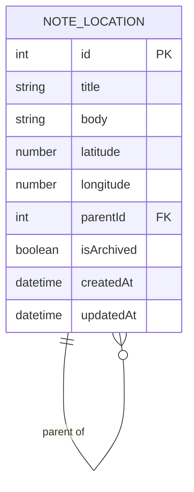
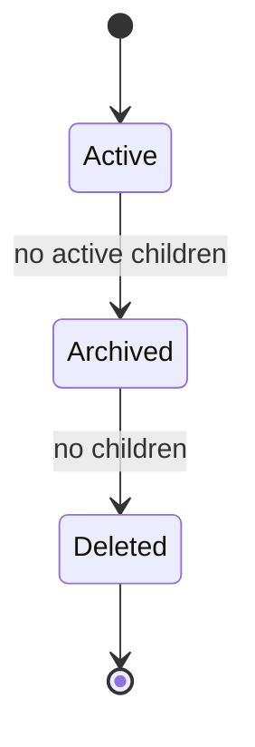

# Data Model: Location-Based Notes

## Note-Location

One note-location combines a map place with optional written travel content.

| Field | Required | Rules |
|---|---|---|
| `id` | Yes | Stable unique identifier. |
| `title` | Yes | Non-blank after trimming; maximum 200 characters; may repeat beneath different parents. |
| `body` | No | Written content; maximum 20,000 characters; empty means structural node. |
| `latitude` | Yes | Map coordinate from -90 through 90. |
| `longitude` | Yes | Map coordinate from -180 through 180. |
| `parentId` | No | One active parent; null denotes a root. Cannot be self or a descendant. |
| `isArchived` | Yes | Defaults false; archived items are list-visible but map-hidden. |
| `createdAt` | Yes | UTC creation time. |
| `updatedAt` | Yes | UTC update time. |

## Rules and Lifecycle

- A tree has arbitrary depth. Each note-location has zero or one parent and any number of children.
- A move carries a complete descendant subtree and must not form a cycle.
- Archive is blocked while active children exist.
- Permanent deletion is blocked unless the item is archived and childless; its written content is deleted with it.

## Local Database Reset

The old flat rows lack required map coordinates. Delete `be/travel-note-api/notes.db` before first run so `EnsureCreated()` produces the new schema. This intentional local-development data loss must be documented in [docs/data-model.md](../../docs/data-model.md) during implementation.