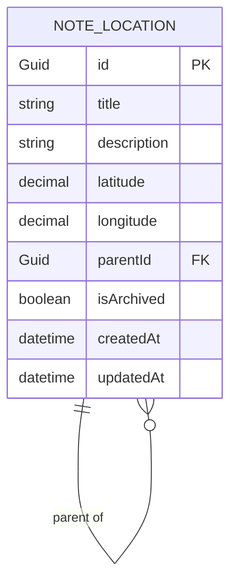
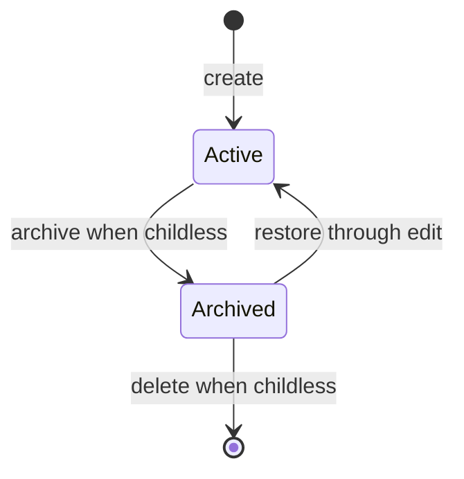

# Data Model: Location-Based Notes

## Note-Location

One note-location represents both a travel note and a geographic node in a manually curated hierarchy.

| Field | Type | Required | Rules |
|---|---|---|---|
| `id` | GUID | Generated | Unique primary identifier, generated when the note-location is created. |
| `title` | string | Yes | Trimmed, non-blank, maximum 200 characters. |
| `description` | string | No | Maximum 20,000 characters; stored as an empty string when omitted. |
| `latitude` | decimal | Yes | Must be within -90 through 90. |
| `longitude` | decimal | Yes | Must be within -180 through 180. |
| `parentId` | GUID | No | References another note-location. Set only on creation and cannot be changed later. |
| `isArchived` | boolean | Yes | Defaults to false. |
| `createdAt` | UTC timestamp | Generated | Set once when created. |
| `updatedAt` | UTC timestamp | Generated | Updated on every successful edit or archive-state change. |

## Relationships

- A note-location has zero or one parent and zero or more direct children.
- Multiple note-locations may have no parent, forming a forest of roots.
- Parents are selected manually; coordinates do not determine relationships.
- A missing parent reference is invalid on creation.

## Lifecycle

- A note-location with children cannot be archived or deleted.
- An active note-location cannot be deleted.
- Archiving/restoring does not alter hierarchy membership, coordinates, or content.
- Deleting a selected note-location returns client selection to its parent, or to no selection for a root.

## Read Models

| Read model | Purpose | Includes |
|---|---|---|
| `NoteLocationDto` | Detail and list/tree node | All persisted fields plus direct-child count. |
| `SearchResultDto` | Type-ahead navigation | Note-location fields needed for display plus ordered ancestor ids/titles. |
| `MapMarkerDto` | Current map context | Id, title, latitude, longitude, archive state. |

## Persistence Decision

The current SQLite schema must be reset before implementation: delete the existing `notes.db`, then let application startup create the location-aware schema. Update the repository data-model documentation at implementation time with this decision.