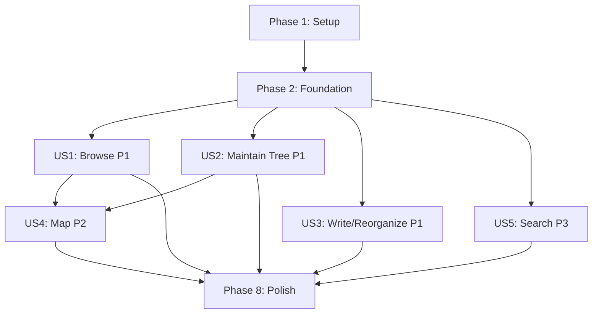

---

description: "Implementation tasks for the location-based notes feature"
---

# Tasks: Location-Based Notes

**Input**: Design documents from `/specs/001-location-based-notes/`

**Prerequisites**: [plan.md](plan.md), [spec.md](spec.md), [research.md](research.md), [data-model.md](data-model.md), [notes-api.md](contracts/notes-api.md), [quickstart.md](quickstart.md)

**Tests**: Frontend Vitest/TestBed coverage is required by the constitution. Backend integration coverage is required because hierarchy validation is non-trivial business logic.

**Organization**: Tasks are grouped by user story so each delivers a testable increment after the shared foundation is complete.

## Format: `[ID] [P?] [Story] Description`

- **[P]**: Can run in parallel with other tasks in its phase after dependencies are met.
- **[Story]**: Identifies the user story served by a task.

## Phase 1: Setup (Shared Infrastructure)

**Purpose**: Add the selected mapping dependency and backend-test capability without changing feature behavior.

- [X] T001 Add the OpenLayers `ol` package and its required CSS import to `fe/travel-notes-app/package.json` and `fe/travel-notes-app/src/styles.css`.
- [X] T002 [P] Create the dedicated map component structure in `fe/travel-notes-app/src/app/features/notes/location-map/`.
- [X] T003 [P] Create a backend test project and add it to `be/travel-note-api/travel-note-api.slnx` for hierarchy API integration coverage.
- [X] T004 [P] Add local database-reset instructions for the required `notes.db` deletion to `docs/development.md`.

---

## Phase 2: Foundational (Blocking Prerequisites)

**Purpose**: Replace the flat note contract and persistence schema with the unified note-location foundation needed by every story.

**WARNING**: Delete `be/travel-note-api/notes.db` before running this feature so `EnsureCreated()` creates the new schema; do not add a migration.

- [X] T005 Replace the flat note fields with note-location parent, geographic position, and archive state in `be/travel-note-api/Models/Note.cs`.
- [X] T006 Configure required fields, bounded geographic values, self-referencing parent relationship, archive state, and hierarchy lookup indexes in `be/travel-note-api/Data/NotesDbContext.cs`.
- [X] T007 Extend request/response DTOs with `latitude`, `longitude`, nullable `parentId`, and `isArchived` plus DataAnnotations validation in `be/travel-note-api/Dtos/NoteDtos.cs`.
- [X] T008 Implement shared mapping and parent-validation helpers in `be/travel-note-api/Controllers/NotesController.cs` to reject missing/archived parents and parent-child cycles.
- [X] T009 Update list, read, create, and update/move endpoints to use the note-location contract, title-only search, and optional archived-item listing in `be/travel-note-api/Controllers/NotesController.cs`.
- [X] T010 Add archive and guarded-delete endpoints defined in `specs/001-location-based-notes/contracts/notes-api.md` to `be/travel-note-api/Controllers/NotesController.cs`.
- [X] T011 Add backend integration coverage for coordinate validation, parent validity, cycle prevention, archive guards, and delete guards in the backend test project created at `be/travel-note-api.Tests/`.
- [X] T012 Mirror the note-location API types in `fe/travel-notes-app/src/app/core/models/note.ts`.
- [X] T013 Extend list, create, update/move, archive, and delete API calls in `fe/travel-notes-app/src/app/core/services/notes-api.ts`.
- [X] T014 Extend signals and mutations for archive state, selected item, hierarchy lookup, and note-location CRUD in `fe/travel-notes-app/src/app/core/services/notes-store.ts`.
- [X] T015 Add focused store coverage for hierarchy-path construction, descendant selection, archived filtering, and mutation refresh behavior in `fe/travel-notes-app/src/app/core/services/notes-store.spec.ts`.
- [X] T016 Update the persistent note-location schema, API shape, local reset decision, and architecture flow in `docs/data-model.md`, `docs/api.md`, and `docs/architecture.md`.

**Checkpoint**: The API returns valid note-locations and the Angular store can load, modify, and query hierarchy data. Run `dotnet build be/travel-note-api/travel-note-api.csproj` and `pnpm --dir fe/travel-notes-app exec ng test --no-watch`.

---

## Phase 3: User Story 1 - Browse Note-Locations (Priority: P1)

**Goal**: A traveler can select a note-location, read its content, browse its descendants, and understand its position through breadcrumbs.

**Independent Test**: Seed Japan > Tokyo > Asakusa with content, select each note-location through the tree/list, confirm its body and breadcrumb path, and toggle inclusion of descendant content.

- [X] T017 [P] [US1] Implement a presentational hierarchy tree/list with selection, archived presentation, and path-aware labels in `fe/travel-notes-app/src/app/features/notes/note-list/`.
- [X] T018 [P] [US1] Implement selected note-location content and descendant-content display in `fe/travel-notes-app/src/app/features/notes/note-item/`.
- [X] T019 [US1] Compose selection state, breadcrumb navigation, and the descendant-content toggle in `fe/travel-notes-app/src/app/features/notes/notes-page/`.
- [X] T020 [US1] Add TestBed coverage for selected-content, empty structural node, breadcrumb, and descendant-toggle behaviors in `fe/travel-notes-app/src/app/features/notes/notes-page/notes-page.spec.ts`.

**Checkpoint**: The P1 browse flow works without the map: a user can traverse the hierarchy, read a node's own/descendant content, and return through breadcrumbs.

---

## Phase 4: User Story 2 - Build and Maintain a Note-Location Tree (Priority: P1)

**Goal**: A note taker can maintain roots and children, move subtrees, and safely archive or delete note-locations.

**Independent Test**: Use the management UI to rename a node, move it with a child to another active parent, verify invalid cycle/archive/delete actions are refused, archive a leaf, then delete that archived leaf.

- [X] T021 [US2] Extend the note-location form with title, optional body, parent selection, archive action, and validation/error presentation in `fe/travel-notes-app/src/app/features/notes/note-form/`.
- [X] T022 [US2] Wire root/child creation, rename, parent move, archive, guarded delete, and user-facing validation failures through `fe/travel-notes-app/src/app/features/notes/notes-page/`.
- [X] T023 [US2] Add TestBed coverage for root versus child management, valid subtree moves, blocked cycles, archive state, and guarded deletion in `fe/travel-notes-app/src/app/features/notes/note-form/` and `fe/travel-notes-app/src/app/features/notes/notes-page/notes-page.spec.ts`.

**Checkpoint**: A user can create and safely maintain a full note-location tree through the custom UI; archived items remain in the tree/list but cannot be deleted until childless.

---

## Phase 5: User Story 3 - Write and Reorganize Note-Locations (Priority: P1)

**Goal**: A note taker can create title-only structural nodes, add optional writing later, and retain content when moving a note-location.

**Independent Test**: Create a title-only Tokyo, add a body, move it under another parent, reload the app, and verify its title, body, position, and new path persist together.

- [X] T024 [US3] Update form mode/state handling so title-only creation, later body editing, and position-preserving parent moves are supported in `fe/travel-notes-app/src/app/features/notes/note-form/` and `fe/travel-notes-app/src/app/features/notes/notes-page/`.
- [X] T025 [US3] Add form and page tests for title-only note-locations, later body entry, and content retention across parent moves in `fe/travel-notes-app/src/app/features/notes/note-form/note-form.spec.ts` and `fe/travel-notes-app/src/app/features/notes/notes-page/notes-page.spec.ts`.

**Checkpoint**: A note-location remains one item throughout its lifecycle: title/position are required and written content is optional, editable, and deleted with an archived leaf.

---

## Phase 6: User Story 4 - Explore the Hierarchy on a Map (Priority: P2)

**Goal**: A traveler can explore active hierarchy levels as map pins and a note taker can create or reposition note-locations through the map.

**Independent Test**: View root pins, select Japan to show child pins, return with a breadcrumb, create a root/child through map clicks, and reposition a pin in edit mode without changing its content or hierarchy.

- [X] T026 [US4] Implement OpenLayers map creation, OpenStreetMap tile source with attribution, map lifecycle cleanup, and projection conversion in `fe/travel-notes-app/src/app/features/notes/location-map/`.
- [X] T027 [US4] Render active current-level note-location pins and emit pin-selection/map-click events from `fe/travel-notes-app/src/app/features/notes/location-map/`.
- [X] T028 [US4] Implement add/edit map modes that emit coordinates for root/child creation and repositioning in `fe/travel-notes-app/src/app/features/notes/location-map/`.
- [X] T029 [US4] Integrate map view level, pin selection, map-click creation, and reposition events with the form and store in `fe/travel-notes-app/src/app/features/notes/notes-page/`.
- [X] T030 [US4] Add component tests for pin filtering, emitted selection/click/reposition events, and page-level map/form integration in `fe/travel-notes-app/src/app/features/notes/location-map/` and `fe/travel-notes-app/src/app/features/notes/notes-page/notes-page.spec.ts`.

**Checkpoint**: Active pins always reflect the selected map level, archive state is respected, and map clicks provide the required coordinates for create/edit operations.

---

## Phase 7: User Story 5 - Search Note-Locations (Priority: P3)

**Goal**: A traveler can find note-locations by title and distinguish duplicate titles by their hierarchy paths.

**Independent Test**: Create two `Ginza` note-locations beneath different parents, search for `Ginza`, select either result, and confirm the displayed paths lead to the correct item.

- [X] T031 [US5] Adapt the existing search input and results presentation to title-only note-location search with hierarchy paths and no-result feedback in `fe/travel-notes-app/src/app/features/notes/notes-page/` and `fe/travel-notes-app/src/app/features/notes/note-list/`.
- [X] T032 [US5] Add tests for duplicate-title paths, search selection, and no-match feedback in `fe/travel-notes-app/src/app/features/notes/notes-page/notes-page.spec.ts` and `fe/travel-notes-app/src/app/core/services/notes-store.spec.ts`.

**Checkpoint**: Search returns matching note-locations by title, clearly identifies duplicate names by path, and navigates to selected results.

---

## Phase 8: Polish & Cross-Cutting Concerns

**Purpose**: Complete documentation, visual consistency, and end-to-end validation.

- [X] T033 [P] Verify all new feature controls use existing shared `ui-*` primitives and token-based styles in `fe/travel-notes-app/src/app/features/notes/` and `fe/travel-notes-app/src/styles.css`.
- [X] T034 [P] Update example requests for all note-location operations in `be/travel-note-api/travel-note-api.http`.
- [X] T035 Execute every scenario in `specs/001-location-based-notes/quickstart.md`, including the local database reset, and correct deviations in the implicated source files.
- [X] T036 Run and resolve failures from `pnpm --dir fe/travel-notes-app exec ng test --no-watch`, `pnpm --dir fe/travel-notes-app build`, and `dotnet build be/travel-note-api/travel-note-api.csproj`.

---

## Dependencies & Execution Order

- Setup and Foundation are blocking prerequisites.
- US1, US2, and US3 can begin after Foundation, but US2/US3 share form and page files and should be completed sequentially unless deliberately coordinated.
- US4 requires US1 selection/breadcrumb behavior and US2 form operations.
- US5 only needs Foundation but should follow US1 to reuse path/navigation presentation.

## Parallel Opportunities

- Phase 1: T002, T003, and T004 can run in parallel after T001's dependency decision is recorded.
- Phase 2: T005/T006/T007 are closely related and should be sequential; T012 can start after the contract in T007, while T011 can start after T010.
- US1: T017 and T018 can run in parallel; T019 integrates them; T020 follows integration.
- US4: T026 is first; T027 and T028 can proceed in parallel after the map lifecycle exists; T029 integrates them.
- Phase 8: T033 and T034 can run in parallel; T035 and T036 follow all feature work.

## Implementation Strategy

### MVP First (User Story 1)

1. Complete Phases 1 and 2 to establish the safe unified persistence/API/store model.
2. Complete Phase 3 so travelers can browse a hierarchy, content, and breadcrumbs without map dependency.
3. Validate the US1 independent test before moving to tree management, map integration, or search.

### Incremental Delivery

1. Add safe tree maintenance (US2) and optional written content workflows (US3).
2. Add OpenLayers map exploration and map-driven placement (US4).
3. Add title search (US5), then complete all quickstart, build, test, and documentation validation.