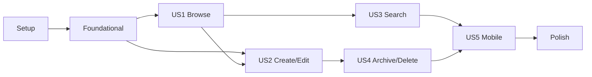

---

description: "Implementation tasks for Location-Based Notes"
---

# Tasks: Location-Based Notes

**Input**: Design documents from `/specs/001-location-based-notes/`

**Prerequisites**: [plan.md](plan.md), [spec.md](spec.md), [research.md](research.md), [data-model.md](data-model.md), [note-locations-api.md](contracts/note-locations-api.md), [quickstart.md](quickstart.md), and the visual reference at `docs/Specs/mockup-frontend.html`

**Tests**: Backend hierarchy/lifecycle tests and Angular Vitest/TestBed tests are required by the plan and constitution.

**Visual target**: The finished browsing screen must closely follow `docs/Specs/mockup-frontend.html`: a compact three-panel desktop workspace (tree/search left, full map center, context right), dark token-driven visual language, clear gold selection, muted archived entries, and map-tree-detail synchronization. On small screens, the map, tree, and context stack in that order.

## Format: `[ID] [P?] [Story] Description`

- **[P]**: Can run in parallel once its dependencies are complete
- **[Story]**: User story served by the task
- Every task contains its exact target path

## Phase 1: Setup

**Purpose**: Prepare the required map dependency and local schema-reset workflow.

- [ ] T001 Add the `ol` OpenLayers package with pnpm, using its bundled TypeScript types, in `fe/travel-notes-app/package.json` and `fe/travel-notes-app/pnpm-lock.yaml`
- [ ] T002 Record the required pre-run deletion of the existing SQLite database in `docs/development.md`
- [ ] T003 Include the OpenLayers base stylesheet in `fe/travel-notes-app/angular.json`

## Phase 2: Foundational

**Purpose**: Establish the GUID-based hierarchy schema, shared frontend model, API boundary, and reusable visual primitives. Blocks all user stories.

- [ ] T004 Replace the flat integer-key note model with a GUID-keyed self-referencing note-location model in `be/travel-note-api/Models/Note.cs`
- [ ] T005 Configure the GUID primary key, optional parent relationship, coordinates, archive state, indexes, and UTC timestamps in `be/travel-note-api/Data/NotesDbContext.cs`
- [ ] T006 Replace note DTO/input definitions with GUID-aware note-location DTOs, validation attributes, and search-result shapes in `be/travel-note-api/Dtos/NoteDtos.cs`
- [ ] T007 Create `be/travel-note-api.Tests/travel-note-api.Tests.csproj`, reference `be/travel-note-api/travel-note-api.csproj`, and add the test-host dependencies
- [ ] T008 [P] Replace the flat note TypeScript interfaces with `NoteLocation`, `NoteLocationInput`, marker, and search-result interfaces in `fe/travel-notes-app/src/app/core/models/note.ts`
- [ ] T009 [P] Add any missing token-driven shared primitives needed by the mockup, such as a compact icon button or toggle control, under `fe/travel-notes-app/src/app/shared/components/` and export them from `fe/travel-notes-app/src/app/shared/components/index.ts`
- [ ] T010 Extend global design tokens only as needed for the mockup's dark panel, gold selection, muted archive, and responsive workspace styling in `fe/travel-notes-app/src/styles.css`
- [ ] T011 Update route-level app shell sizing and background behavior for the map workspace in `fe/travel-notes-app/src/app/app.css`

**Checkpoint**: Delete the pre-feature `notes.db`, start the backend, and confirm a new database can be created with GUID note-location schema.

## Phase 3: User Story 1 - Browse a Location Hierarchy (Priority: P1)

**Goal**: Browse roots and nested note-locations from a collapsible tree or map marker while keeping the map, selected node, breadcrumb, and detail panel synchronized.

**Independent Test**: Seed roots and descendants, select entries from both the tree and map, and verify the active node, ancestor path, detail, and direct-child or leaf marker state always agree.

- [ ] T012 [US1] Write hierarchy and root/direct-child read contract tests in `be/travel-note-api.Tests/NotesControllerTests.cs`
- [ ] T013 [US1] Implement root, direct-child, and GUID detail reads plus DTO mapping in `be/travel-note-api/Controllers/NotesController.cs`
- [ ] T014 [P] [US1] Implement the hierarchy-aware HTTP client reads in `fe/travel-notes-app/src/app/core/services/notes-api.ts`
- [ ] T015 [US1] Refactor signal state for roots, loaded children, selection, expanded ancestor IDs, derived breadcrumb, and map markers in `fe/travel-notes-app/src/app/core/services/notes-store.ts`
- [ ] T016 [P] [US1] Add selection, direct-child marker, leaf-marker, and breadcrumb tests in `fe/travel-notes-app/src/app/core/services/notes-store.spec.ts`
- [ ] T017 [P] [US1] Create the presentational, recursive, collapsible location tree with selected and archived states in `fe/travel-notes-app/src/app/features/notes/location-tree/location-tree.ts`, `fe/travel-notes-app/src/app/features/notes/location-tree/location-tree.html`, and `fe/travel-notes-app/src/app/features/notes/location-tree/location-tree.css`
- [ ] T018 [P] [US1] Create the OpenLayers map wrapper that renders OpenStreetMap tiles, fits current markers, emits marker selection, and cleans up map resources in `fe/travel-notes-app/src/app/features/notes/location-map/location-map.ts`, `fe/travel-notes-app/src/app/features/notes/location-map/location-map.html`, and `fe/travel-notes-app/src/app/features/notes/location-map/location-map.css`
- [ ] T019 [P] [US1] Add OnPush input/output contract tests for the location tree in `fe/travel-notes-app/src/app/features/notes/location-tree/location-tree.spec.ts`
- [ ] T020 [P] [US1] Add map adapter tests for marker rendering/selection and map teardown in `fe/travel-notes-app/src/app/features/notes/location-map/location-map.spec.ts`
- [ ] T021 [US1] Replace the flat notes page with the three-panel browse workspace shell, composing shared controls plus the tree and map while reserving the right context panel for detail content in `fe/travel-notes-app/src/app/features/notes/notes-page/notes-page.ts`, `fe/travel-notes-app/src/app/features/notes/notes-page/notes-page.html`, and `fe/travel-notes-app/src/app/features/notes/notes-page/notes-page.css`
- [ ] T022 [US1] Create the read-only detail panel with breadcrumb and mockup-aligned browse actions, then integrate it into the notes-page context panel in `fe/travel-notes-app/src/app/features/notes/location-detail/location-detail.ts`, `fe/travel-notes-app/src/app/features/notes/location-detail/location-detail.html`, `fe/travel-notes-app/src/app/features/notes/location-detail/location-detail.css`, `fe/travel-notes-app/src/app/features/notes/notes-page/notes-page.ts`, and `fe/travel-notes-app/src/app/features/notes/notes-page/notes-page.html`
- [ ] T023 [US1] Compare the desktop browse screen against `docs/Specs/mockup-frontend.html` and correct layout, panel proportions, selected/archived styles, and map/context behavior in `fe/travel-notes-app/src/app/features/notes/notes-page/notes-page.css`

**Checkpoint**: User Story 1 works with roots, deep descendants, parent content, map-driven selection, and a selected leaf showing only its own marker.

## Phase 4: User Story 2 - Create and Edit Note-Locations (Priority: P1)

**Goal**: Create root/child locations from a map point and edit title, description, position, and archive state without allowing reparenting.

**Independent Test**: Create a root and child using map clicks, edit each location, and verify the refreshed tree, detail, and map show the changed values while the parent remains immutable.

- [ ] T024 [US2] Write create/update contract tests for GUIDs, coordinate bounds, blank descriptions, unknown parents, and immutable parents in `be/travel-note-api.Tests/NotesControllerTests.cs`
- [ ] T025 [US2] Implement validated GUID creation and immutable-parent updates in `be/travel-note-api/Controllers/NotesController.cs`
- [ ] T026 [P] [US2] Add create/update request methods to `fe/travel-notes-app/src/app/core/services/notes-api.ts`
- [ ] T027 [US2] Add create-root, create-child, edit, save, cancel, coordinate draft, and post-save selection flows to `fe/travel-notes-app/src/app/core/services/notes-store.ts`
- [ ] T028 [P] [US2] Extend map edit mode to show a movable draft marker and emit OpenLayers click coordinates in `fe/travel-notes-app/src/app/features/notes/location-map/location-map.ts` and `fe/travel-notes-app/src/app/features/notes/location-map/location-map.spec.ts`
- [ ] T029 [US2] Replace the flat note form with a reusable create/edit detail form using shared field, input, textarea, and button primitives in `fe/travel-notes-app/src/app/features/notes/location-detail/location-detail.ts`, `fe/travel-notes-app/src/app/features/notes/location-detail/location-detail.html`, and `fe/travel-notes-app/src/app/features/notes/location-detail/location-detail.css`
- [ ] T030 [P] [US2] Add reactive-form validation and create/edit input/output tests in `fe/travel-notes-app/src/app/features/notes/location-detail/location-detail.spec.ts`
- [ ] T031 [US2] Wire add-root, add-child, edit, map-point selection, save, and cancel transitions through the context panel in `fe/travel-notes-app/src/app/features/notes/notes-page/notes-page.ts` and `fe/travel-notes-app/src/app/features/notes/notes-page/notes-page.html`

**Checkpoint**: User Story 2 creates titled root and child note-locations from map points, updates content/coordinates, and never exposes a parent picker when editing.

## Phase 5: User Story 3 - Find a Note-Location (Priority: P2)

**Goal**: Use type-ahead results to locate nested items and open them in the same tree/map/detail context.

**Independent Test**: Search a nested title and description, select each suggestion, and verify its ancestors open and its map/detail state becomes active.

- [ ] T032 [US3] Write escaped title/description search and ancestor-chain response tests in `be/travel-note-api.Tests/NotesControllerTests.cs`
- [ ] T033 [US3] Implement GUID-aware type-ahead search with escaped patterns and ordered ancestor results in `be/travel-note-api/Controllers/NotesController.cs`
- [ ] T034 [P] [US3] Add type-ahead search calls and response mapping in `fe/travel-notes-app/src/app/core/services/notes-api.ts`
- [ ] T035 [US3] Add debounced search suggestions, selection-by-result, and ancestor-expansion state transitions in `fe/travel-notes-app/src/app/core/services/notes-store.ts` and `fe/travel-notes-app/src/app/core/services/notes-store.spec.ts`
- [ ] T036 [US3] Create the shared-primitive-backed search input and suggestion list, including no-result state and keyboard-accessible selection, in `fe/travel-notes-app/src/app/features/notes/location-search/location-search.ts`, `fe/travel-notes-app/src/app/features/notes/location-search/location-search.html`, `fe/travel-notes-app/src/app/features/notes/location-search/location-search.css`, and `fe/travel-notes-app/src/app/features/notes/location-search/location-search.spec.ts`
- [ ] T037 [US3] Integrate type-ahead search above the left tree panel while preserving the mockup's compact panel rhythm in `fe/travel-notes-app/src/app/features/notes/notes-page/notes-page.html` and `fe/travel-notes-app/src/app/features/notes/notes-page/notes-page.css`

**Checkpoint**: User Story 3 search never replaces navigation; selecting a suggestion expands its ancestors and synchronizes tree, map, breadcrumb, and detail.

## Phase 6: User Story 4 - Archive and Delete Leaf Locations (Priority: P2)

**Goal**: Archive, restore, and delete only permitted leaf note-locations, with useful blocked-action feedback.

**Independent Test**: Archive/restore/delete a leaf and attempt those operations on a parent; verify visual archive state and server-enforced explanations.

- [ ] T038 [US4] Write archive, restore, active-delete, and has-children rejection tests in `be/travel-note-api.Tests/NotesControllerTests.cs`
- [ ] T039 [US4] Enforce archive-state transitions and archived-childless-only deletion with actionable validation responses in `be/travel-note-api/Controllers/NotesController.cs`
- [ ] T040 [P] [US4] Add delete and archive-state update methods to `fe/travel-notes-app/src/app/core/services/notes-api.ts`
- [ ] T041 [US4] Add archive, restore, delete, blocked-action message, and post-delete parent/no-selection transitions to `fe/travel-notes-app/src/app/core/services/notes-store.ts` and `fe/travel-notes-app/src/app/core/services/notes-store.spec.ts`
- [ ] T042 [US4] Add the archived edit indicator, restore toggle, archive/delete commands, disabled parent actions, and visible blocked-action explanation to `fe/travel-notes-app/src/app/features/notes/location-detail/location-detail.ts`, `fe/travel-notes-app/src/app/features/notes/location-detail/location-detail.html`, and `fe/travel-notes-app/src/app/features/notes/location-detail/location-detail.css`
- [ ] T043 [US4] Confirm archived tree entries remain muted, visible, searchable, and selectable in `fe/travel-notes-app/src/app/features/notes/location-tree/location-tree.html` and `fe/travel-notes-app/src/app/features/notes/location-tree/location-tree.css`

**Checkpoint**: User Story 4 protects the hierarchy on both API and UI paths, with archive state visibly matching the supplied mockup.

## Phase 7: User Story 5 - Use the App While Travelling (Priority: P3)

**Goal**: Deliver the complete workflow on a small screen with map, tree, and context vertically ordered and no horizontal scrolling.

**Independent Test**: At a phone viewport, complete browse, search, create, edit, archive, restore, and delete without horizontal scrolling.

- [ ] T044 [US5] Implement responsive grid breakpoints that preserve the mockup's desktop three-panel proportions and stack map, tree, then context on small screens in `fe/travel-notes-app/src/app/features/notes/notes-page/notes-page.css`
- [ ] T045 [P] [US5] Make the location tree, search suggestions, map height, and detail/form actions touch-friendly without horizontal overflow in `fe/travel-notes-app/src/app/features/notes/location-tree/location-tree.css`, `fe/travel-notes-app/src/app/features/notes/location-search/location-search.css`, `fe/travel-notes-app/src/app/features/notes/location-map/location-map.css`, and `fe/travel-notes-app/src/app/features/notes/location-detail/location-detail.css`
- [ ] T046 [US5] Add small-screen layout and control-visibility tests in `fe/travel-notes-app/src/app/features/notes/notes-page/notes-page.spec.ts`

**Checkpoint**: User Story 5 reproduces the intended map-first stacked layout and retains every feature workflow on mobile.

## Phase 8: Polish and Cross-Cutting Concerns

**Purpose**: Finish documentation, validate contracts, and make the visual reference an acceptance gate.

- [ ] T047 [P] Update the implemented GUID hierarchy schema, reset instructions, and relationships in `docs/data-model.md`
- [ ] T048 [P] Update hierarchy, type-ahead, archive/delete, GUID route/query, and validation behavior in `docs/api.md`
- [ ] T049 [P] Update the location-notes component hierarchy, OpenLayers wrapper, shared primitives, and signal store responsibilities in `docs/frontend.md`
- [ ] T050 [P] Update the map dependency, expanded notes data flow, and local reset decision in `docs/architecture.md`
- [ ] T051 Seed 1,000 note-locations and measure repeated type-ahead searches against the two-second, 95% success threshold in `be/travel-note-api.Tests/NotesControllerTests.cs`
- [ ] T052 Run backend contract, lifecycle, and search-performance tests with `dotnet test be/travel-note-api.Tests/travel-note-api.Tests.csproj` and resolve failures in `be/travel-note-api.Tests/NotesControllerTests.cs`
- [ ] T053 Run frontend tests with `pnpm --dir fe/travel-notes-app exec ng test --no-watch`, using `fe/travel-notes-app/angular.json` as the test-runner configuration
- [ ] T054 Build the frontend with `pnpm --dir fe/travel-notes-app build`, using `fe/travel-notes-app/package.json` as the build-script definition
- [ ] T055 Execute every scenario in `specs/001-location-based-notes/quickstart.md` against the running app and fix discrepancies in the relevant source or durable documentation file
- [ ] T056 Compare desktop and small-screen running-app screenshots with `docs/Specs/mockup-frontend.html`; correct visible deviations in `fe/travel-notes-app/src/app/features/notes/notes-page/notes-page.css` and component styles before completion

## Dependencies and Execution Order



- Setup and Foundational phases must finish first.
- US1 is the MVP and establishes the map/tree/detail shell used by every later story.
- US2 depends on US1 map/context ownership.
- US3 depends on US1 selection and expansion state.
- US4 depends on US2 edit state and uses US1 tree presentation.
- US5 can begin after the shared desktop shell exists, but final mobile validation requires all stories.

## Parallel Execution Examples

### User Story 1

```text
T017 location tree, T018 map wrapper, T019 tree tests, and T020 map tests can proceed in parallel after T015.
```

### User Story 2

```text
T026 API client methods and T028 map edit-mode work can proceed in parallel after T025.
```

### User Story 3

```text
T034 API client search work can proceed in parallel with T032 backend tests before T035 integrates store state.
```

### User Story 4

```text
T040 API client methods can proceed in parallel with T038 backend tests before T041 integrates the store lifecycle.
```

### User Story 5

```text
T045 component-level touch and overflow styling can proceed in parallel with T044 workspace breakpoint work.
```

## Implementation Strategy

1. Complete Setup and Foundational work, including the local database reset, GUID schema, custom shared controls, and map dependency.
2. Deliver US1 as the MVP. It must render the visual workspace close to the mockup and prove synchronized hierarchy browsing.
3. Add US2 map-driven capture and editing, then US3 type-ahead navigation and US4 guarded lifecycle actions.
4. Complete US5 responsive behavior, then use the quickstart and screenshot comparison as functional and visual completion gates.